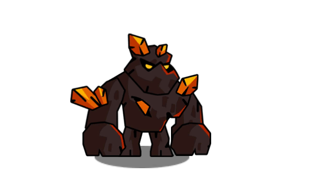
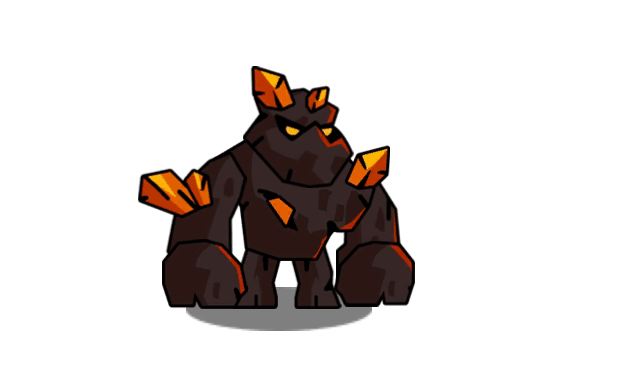
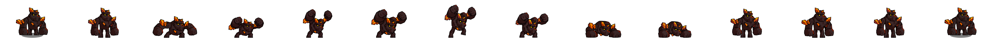
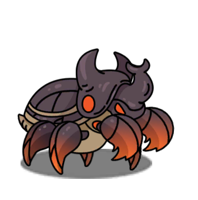
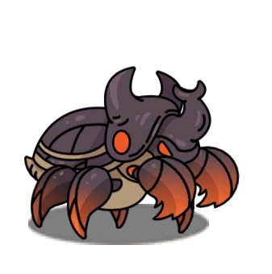
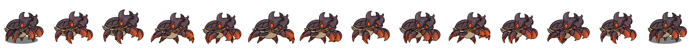

<div align="center">

# 2dimg2motion.skill


[](LICENSE)
[](https://agentskills.io)
[]()


<br>

**2dimg2motion.skill--将一张静态 2D 角色/物体图片，通过 AI 图像生成转化为一致的透明背景游戏动画序列帧。**

<br>

Turn one baseline 2D character, creature, or prop image into consistent transparent<br>
game-animation frames through whole-character key-pose redraw<br>
  and reference-guided in-betweens.


</div>

---


## 示例 / Examples


<table>
  <tr>
    <th>示例 / Example</th>
    <th>基准图 / Input</th>
    <th>动画预览 / Preview</th>
  </tr>
  <tr>
    <td>双拳重砸 / Ground Smash</td>
    <td></td>
    <td></td>
  </tr>
  <tr>
    <td colspan = "3"></td>
  </tr>
  <tr>
    <td>甲壳生物行走 / Creature Walk</td>
    <td></td>
    <td></td>
  </tr>
  <tr>
    <td colspan = "3"></td>
  </tr>
</table>

## 这是什么 / What This Is

一个 **AI 驱动的 2D 游戏动画帧生成管线**。输入一张角色设定图，输出一套风格一致、可直用于游戏引擎的透明动画序列帧。

它不是"给单图加动效"的补间工具，而是一个完整的**整角色重绘管线**：AI 理解角色的视觉特征后，逐帧重绘角色的每一个关键姿势和补间帧，确保透视、遮挡、挤压拉伸等传统动画原则被正确表达。

A **Claude Code custom skill** that implements a full animation pipeline: one baseline image in → consistent transparent sprite frames out. Not a tweening tool — every pose is redrawn as a whole character, preserving perspective, foreshortening, and squash-and-stretch.

## 适合谁用 / Who It's For

| 角色 | 场景 |
|---|---|
| **独立游戏开发者 / Solo & Indie Devs** | 没有专属像素画师或动画师，需要为角色快速产出可用动作帧做原型或正式素材 |
| **原型阶段团队 / Prototyping Teams** | 在美术资源到位前，用 AI 生成的序列帧验证玩法和手感 |
| **AI 辅助美术管线探索者** | 研究如何将 AI 图像生成纳入正规游戏美术生产流程 |

如果已有成熟美术团队且对风格一致性要求极高，这个工具更适合作为**快速预演/占位素材**而非最终交付。

## 产出 / Deliverables

一次完整的动画生成会产出以下文件：

```
output/
├── keyframe/            # 4 个关键帧 — 固定索引 02/05/08/11
├── fullframe/           # 14 个透明 RGBA 序列帧 — 固定索引 00-13
├── spritesheet.png      # 精灵表 — 单图打包所有帧，适配 2D 引擎
├── contact-sheet.png    # 一致性审阅图 — 所有帧并排，便于检查身份漂移
├── preview.gif          # 14 帧播放预览 — 固定纯白 #FFFFFF 背景
└── manifest.json        # 元数据清单 — 记录画布尺寸、帧顺序、基线等参数
```

每一帧都保证：**RGBA 透明背景、统一画布尺寸、稳定脚部基线、连续命名**。可直接拖入 Godot 的 `AnimatedSprite2D` 或 Unity 的 `Sprite Animation` 使用。

## 核心思路 / Core Principle

先建立身份锁（identity lock），批准共享关键姿势表，再以原始图和关键姿势表为参考生成所有补间帧。**绝不独立生成每一帧。**

Establish an identity lock, approve shared key poses, then generate all in-betweens from the baseline and key-pose sheet. Never generate every frame independently.

## 支持的动作类型 / Supported Motion Types

| 动作 | 节拍 / Beats |
|---|---|
| 待机 / Idle | 下沉 → 抬起 → 下沉 |
| 行走 / Walk | 触地 → 下沉 → 迈步 → 上升 → 对侧触地 |
| 攻击 / Attack | 防御 → 预备 → 加速 → 命中 → 命中保持 → 恢复 |
| 受击 / Hit | 命中 → 后仰 → 恢复 |
| 死亡 / Death | 失衡 → 崩塌 → 冲击 → 静止 |

## 工作流 / Workflow

1. **身份锁 / Identity Lock** — 从原图记录不可变特征（面部、配色、比例、纹章、武器等）
2. **动作节拍设计 / Motion Beat Design** — 选定动作类型，拆解 3-5 个关键姿势
3. **关键姿势表 / Key-Pose Sheet** — 在一张等分网格上整角色重绘所有关键姿势
4. **补间帧生成 / In-Betweens** — 以原始图 + 已批准关键姿势表为双重参考，按序生成
5. **去背景与归一化 / Background Removal & Normalize** — 移除色键，统一缩放对齐
6. **漂移修正 / Drift Correction** — 修复帧间身份和轨迹漂移
7. **验证 / Validate** — 运行脚本 + 目视检查

## 使用方式 / Usage

这是一个 Claude Code 自定义技能。在对话中提供一张基准角色图片，并描述所需的动作类型即可触发。

This is a Claude Code custom skill. Provide a baseline character image and describe the desired motion type to trigger it.

```
示例 / Example:
"用这张魔像图做一个重砸地面攻击动画。"
"Use this golem image to make a heavy ground-smash attack."
```


## 验证 / Validate

```bash
python scripts/validate_14frame_pattern.py --baseline source.png --keyframes-dir output/keyframe --fullframes-dir output/fullframe --preview output/preview.gif --prefix hero-attack
```

检查项：14 帧连续命名、RGBA 模式、统一画布与脚底基线、透明四角、基准首尾一致、关键帧与完整帧逐像素一致、GIF 纯白背景

## 依赖 / Dependencies

- Python 3.x + [Pillow](https://python-pillow.org/)
- OpenAI 图像生成接口（通过 `agents/openai.yaml` 配置）

## 许可 / License

MIT © 2026 Haotian Wu
